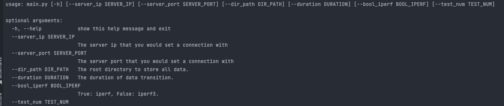

# 网络抓包
## 问题介绍
使用Iperf测量两台PC间的网络吞吐量。  
我们考虑的情况，client为本地Ubuntu虚拟机，server为阿里云服务器（具有公网ip）  
目的是，测试在client端切换不同拥塞控制算法对网络吞吐量是否有影响。  
## 实验方法
使用iperf/iperf3工具进行吞吐量测试，考虑到不同时间网络中数据传输的具体情况不同
需要尽可能减少其他因素对传输吞吐量对影响，即控制变量。我们的策略是

- 采集大量的数据
- 数据采集的时间基本一致
- 然后统计学上的数据分析，来判断是否有显著性影响

## 实验内容
### 1. 数据收集

使用iperf建立TCP连接，并传输数据，其中需要控制的参数有

- 窗口大小
- 传输时间/传输数据量
- 是否双向传输

然后以秒为单位，输出该传输过程的实时统计，保存到文件。

iperf和iperf3是两个不兼容的命令，因此，我们将这两个工具分别使用来测试数据传输情况。

#### iperf

**客户端client指令：**

```shell
iperf -c [server_ip] -p [server_port] -w [window_size] -f M -i 1 -d -Z [algo]  -t 600 >> log_filename
```

命令解释

```shell
-c server_ip # 开启客户端服务，连接server
-p server_port # 服务器的端口号
-w window_size # 设置窗口大小为window_size，可以修改该值，测试不同结果
-f M # 以Mbypes为数据单位打印
-i 1 # 每次报告的间隔，单位为秒
-d # 同时进行双向测试
-Z algo # 在Linux内核中设置拥塞控制算法 
-t 600 # 运行10分钟
log_filename # 输出到文件log_filename
```

**服务端server指令：**

```shell
iperf -s -p 5001
```

命令解释

```shell
-s # 开启服务端服务
-p # 设置端口号为5001
```

这里xu

#### iperf3

**客户端client指令：**

```shell
iperf3 -c [server_ip] -p [server_port] -w [window_size] -f M -i 1  -C [algo] --logfile [log_filename] -t 600
```

命令解释

```shell
-c server_ip # 开启客户端服务，连接server
-p server_port # 服务器的端口号
-w window_size # 设置窗口大小为window_size，可以修改该值，测试不同的结果
-f M # 以Mbytes为数据单位打印
-i 1 # 每次报告的间隔，单位为秒
-C [algo] # 设置拥塞控制算法
--logfile log_filename #输出日志到文件log_filename
-t 600 # 运行10分钟
```

**服务端server指令：**

```shell
iperf3 -s -p 5001
```

命令解释

```shell
-s # 开启服务端服务
-p # 设置端口号为5001
```

### 2. 加载拥塞控制模块

查看系统中安装的拥塞控制算法模块

```shell
ls -la /lib/modules/$(uname -r)/kernel/net/ipv4
```

安装指定模块，每一条指令都是对一个拥塞控制算法进行加载

```shell
modprobe -a tcp_westwood
modprobe -a tcp_vegas
modprobe -a tcp_bic
modprobe -a tcp_htcp
modprobe -a tcp_bbr
```

## 实验步骤

我们列出多种实验场景下，进行实验的命令。

| window_size        | algo     | time       |
| ------------------ | -------- | ---------- |
| 4K                 | cubic    | 9:00-22:00 |
| iperf default: 8K  | reno     | other      |
| linux default: 16K | bbr      |            |
| 32K                | bic      |            |
| 64K                | vegas    |            |
| 128K               | westwood |            |

我们每组测试数据为10次，对于命令的输出文件，我们使用命名方式为：

**packets_8K_cubic_0_1.txt 或者packets_8K_cubic_0_1.json**

通过枚举，我们可以得到需要测量的数据有**6x6x2=72**组数据，每组数据测量若干个。

为了方便控制该测试过程，我们使用python编程语言来实现。

## 编程设计

类 TransTool

在吞吐量测试时需要传递的参数：

- window_size
- algo
- duration

在实例化对象时，需要传递的参数：

- server_ip
- server_port
- bool_iperf：True使用iperf，False使用iperf3

略

## 如何使用

 可自定义的的变量

```python
is_iperf = True # True: iperf, False: iperf3
aliyun = '47.94.104.34'
dir_p = 'algos' # The name of directory we used to store all packets.
dura = 300  # The duration we test every time
window_sizes = ['4K', '8K', '16K', '32K', '64K', '128K'] # The window size we can set.
test_num = 500 # The number we decide to test.
```

其中aliyun为TransTool的初始化参数，也可以根据自己的需要传入多个自定义参数。

在main函数中，我们实现的内容为：

测试500组数据，每次测试时，随机选择一个窗口大小和拥塞控制算法，进行吞吐量测试，并将日志保存到为文件，如

-- algos

​	-- cubic

​		-- packets_8K_cubic_0_1.txt

如上述文件目录，我们进行iperf测试，选择的拥塞控制算法为cubic，窗口大小为8KB，测试时间在8到22时之间，是第1组数据。

**Client**

```python
python3 main.py --help
```



根据自己的需要填写合适的参数。

**Server**

```
iperf -s -p 5001
```

5001是本程序中默认的端口号，如果自定义端口号，那么该处的端口号要互相对应。

## 讨论

在python脚本中执行shell命令，iperf的运行时间为300秒，该命令在for循环中，可能涉及到进程阻塞的问题。我们的目标是，执行到该命令，python程序阻塞，直到该shell命令完成后，继续执行后面的指令。但是现在没有考虑到阻塞的问题，可能会出现一定的问题，需要实验来查看是否会出现问题。

## Reference

1. [How to find the socket buffer size of linux](https://stackoverflow.com/questions/7865069/how-to-find-the-socket-buffer-size-of-linux)

